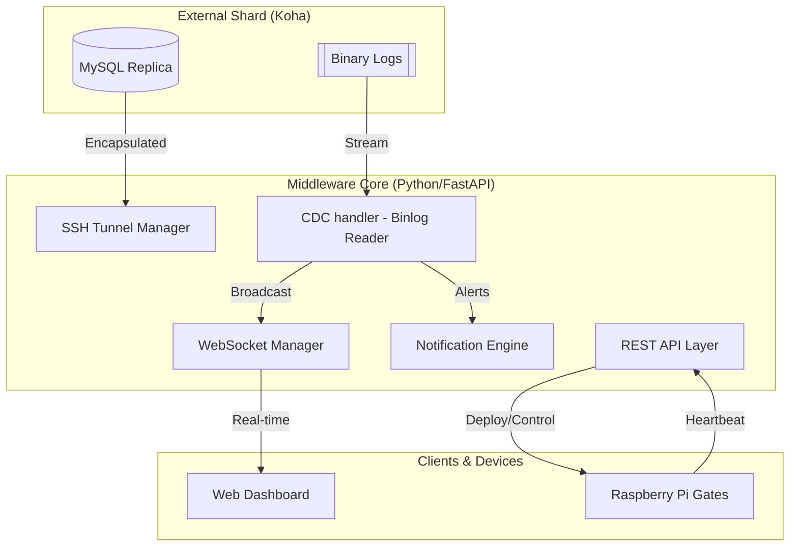
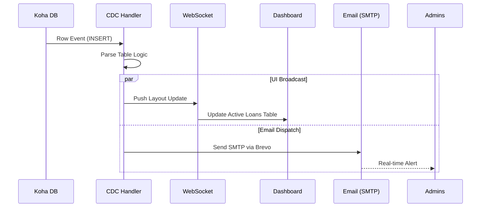

# JPL Security & IoT Middleware: Technical Architecture

This document provides a comprehensive technical breakdown of the JPL Library Security Monitor and IoT Middleware system.

## 1. System Overview
The JPL Middleware is an industrial-grade synchronization layer designed to bridge a Koha ILS (Integrated Library System) with physical security hardware (RFID Gates) and real-time monitoring dashboards.

### Core Objectives:
*   **Real-Time Monitoring**: Instant detection of circulation events (Issues/Returns).
*   **Edge Connectivity**: Secure management of Raspberry Pi nodes at library exits.
*   **Multi-Channel Notifications**: Real-time WebSocket updates and SMTP email alerts.

---

## 2. High-Level Architecture



---

## 3. Technical Stack
*   **Backend**: Python 3.10+ (FastAPI)
*   **Concurrency**: Asynchronous I/O (AsyncIO)
*   **Data Capture**: `python-mysql-replication` (BinLog streaming)
*   **Infrastructure**: `Paramiko` (SSH), `SSHTunnelForwarder`
*   **Frontend**: Vanilla JavaScript (ES6+), WebSocket API, CSS3 (Enterprise Aesthetics)

---

## 4. Subsystem Deep-Dives

### 4.1 Real-Time CDC Pipeline (Change Data Capture)
Unlike traditional polling (which is slow and high-overhead), this system uses a "push" model by monitoring the MySQL Binary Log.

**The Workflow:**
1.  A librarian issues a book in Koha.
2.  The MySQL database writes an `INSERT` row event to the `issues` table.
3.  The Middleware's **BinLogStreamReader** identifies the event across the SSH tunnel.
4.  The `CDCHandler` parses the raw bytes into a Python dictionary.
5.  **Broadcast**: The event is sent to the Frontend via WebSockets.
6.  **Notification**: The SMTP engine fires an email to the administrator.

### 4.2 IoT Node Deployment Engine
The system manages remote IoT gates via an automated injection pipeline:
1.  **ARP Scanner**: Scans the network to find Raspberry Pi devices (MAC OUI matching).
2.  **SSH Injection**: The Middleware connects to the Pi via SSH.
3.  **Agent Deployment**: A lightweight Python Agent is written to the Pi's `/tmp` directory.
4.  **Auto-Start**: The Middleware executes the agent as a background service (`nohup`).

---

## 5. Key Implementation Snippets

### 5.1 Real-Time Event Dispatch
Located in `cdc_handler.py`, this handles the conversion of database rows to UI alerts:
```python
async def handle_event(self, event):
    for row in event.rows:
        table = event.table.lower()
        if table == "issues" and event_type == "INSERT":
            alert = {"title": "📚 Book Checked Out!", "msg": f"Item issued to borrower."}
            await send_notification_email(alert['title'], alert['msg'])
            await self.broadcast_callback(alert)
```

### 5.2 Dynamic Topology Map
The frontend uses a relative-positioning engine to create the "Network Graph." When a node is dragged, it triggers a live recalculation of the SVG Bezier paths:
```javascript
function drawLines() {
    const p1 = outXY(koha_node);
    const p2 = inXY(mid_node);
    svg_path.setAttribute('d', `M ${p1.x} ${p1.y} C ${cx} ${p1.y}, ${cx} ${p2.y}, ${p2.x} ${p2.y}`);
}
```

---

## 6. Security & Infrastructure
*   **SSH Encapsulation**: ALL database traffic is tunneled through an encrypted SSH channel to 137.184.15.52. Local ports are bound dynamically to avoid conflicts.
*   **CORS Policy**: Configured strictly to allow middleware access only to authorized library origins.
*   **JWT Readiness**: The `auth.py` module is structured to support Bearer Tokens for future expansion.

---

## 7. Operational Flow Chart



© 2026 JPL Security Systems. All Technical Rights Reserved.


# JPL-IOT-MIDDLEWARE


