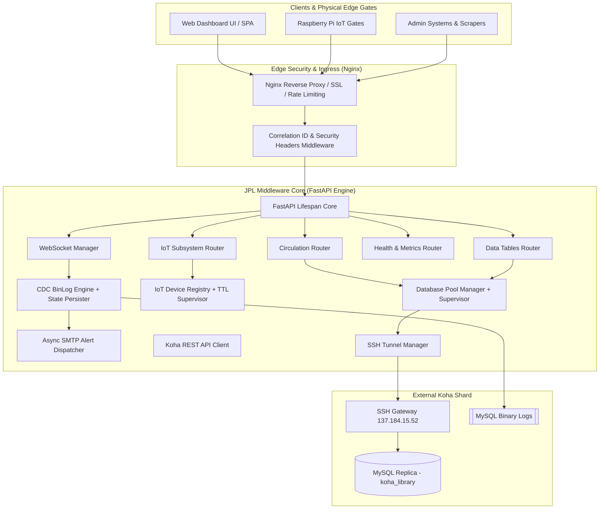

# JPL Security & IoT Middleware (Enterprise Edition)

[](file:///c:/Users/thila/OneDrive/Desktop/MIDDLE/JPL-IOT-MIDDLEWARE/app/core/config.py)
[](https://fastapi.tiangolo.com)
[](https://python.org)
[](file:///c:/Users/thila/OneDrive/Desktop/MIDDLE/JPL-IOT-MIDDLEWARE/Dockerfile)
[](file:///c:/Users/thila/OneDrive/Desktop/MIDDLE/JPL-IOT-MIDDLEWARE/tests/)

The **JPL Security & IoT Middleware** is an industrial-grade synchronization and security layer designed to bridge a **Koha ILS (Integrated Library System)** with physical **RFID Security Gates (Raspberry Pi)** and real-time operations dashboards.

---

## 1. Architectural Overview



---

## 2. Core Capabilities & Production Features

| Subsystem | Feature | Technical Detail |
| :--- | :--- | :--- |
| **CDC Pipeline** | **MySQL Binary Log Streaming** | Reads row-level mutations (`issues`, `old_issues`, `borrowers`) in real-time across encrypted SSH tunnels with zero polling latency. |
| **State Persistence** | **Resume & Replay Protection** | Persists binlog coordinates (`log_file`, `log_pos`) to `.cdc_state.json` on disk to resume seamlessly after restarts without duplicate or missed events. |
| **Database Pool** | **Self-Healing Supervisor** | Asynchronous connection pooling with `aiomysql`, connection recycling, ping health supervisor, and exponential backoff auto-reconnect. |
| **IoT Node Manager** | **Edge Agent Injection & TTL** | Automated ARP network scanner, SSH agent deployment daemon, and heartbeat timeout supervisor (auto-detects offline gates). |
| **Email Alerts** | **Async SMTP Dispatcher** | Non-blocking multipart HTML/plain-text alert engine with rate-limiting protection to prevent inbox flooding. |
| **Observability** | **Cloud-Native Probes** | `/healthz` (liveness), `/ready` (readiness), `/api/health` (diagnostics), and `/api/metrics` (Prometheus metrics). |
| **Security** | **Hardened Endpoints** | Optional API Key validation (`X-API-Key`), SQL identifier sanitization, and enterprise security headers (`HSTS`, `CSP`, `X-Frame-Options`, `nosniff`). |

---

## 3. Quickstart & Local Setup

### Prerequisites
* Python 3.10+ (tested on Python 3.10, 3.11, 3.12, 3.14)
* OpenSSH & MySQL Client libraries

### Step 1: Clone and Configure Environment
```bash
git clone https://github.com/Thilac01/JPL-IOT-MIDDLEWARE.git
cd JPL-IOT-MIDDLEWARE

# Create your .env file
cp .env.example .env
```

### Step 2: Install Dependencies
```bash
pip install -r requirements.txt
```

### Step 3: Run the Application
```bash
python run.py
```
Open your browser at `http://localhost:8000` to access the interactive dashboard.

---

## 4. Production Deployment Options

### Option A: Docker Compose (Recommended)

1. Build and launch the containerized stack:
   ```bash
   docker-compose up -d --build
   ```

2. Inspect container status and health:
   ```bash
   docker-compose ps
   docker-compose logs -f middleware
   ```

### Option B: Linux Systemd Service

1. Copy the systemd service unit file:
   ```bash
   sudo cp jpl-middleware.service /etc/systemd/system/
   sudo systemctl daemon-reload
   ```

2. Enable and start the service:
   ```bash
   sudo systemctl enable --now jpl-middleware
   sudo systemctl status jpl-middleware
   ```

3. View live journal logs:
   ```bash
   journalctl -u jpl-middleware -f
   ```

### Option C: Gunicorn Multi-Worker ASGI

For high-concurrency bare-metal Linux servers:
```bash
gunicorn -c gunicorn_conf.py main:app
```

---

## 5. Nginx Reverse Proxy & SSL Configuration

A pre-configured production Nginx template is provided in [`nginx.conf`](file:///c:/Users/thila/OneDrive/Desktop/MIDDLE/JPL-IOT-MIDDLEWARE/nginx.conf).

Key reverse proxy highlights:
* **WebSocket Upgrade**: Handles persistent `/ws` bidirectional communication.
* **Rate Limiting**: Protects `/api/` (30 req/s) and `/api/iot/` (10 req/s) from brute force / DDoS.
* **Gzip Compression**: Compresses JSON and static assets for reduced latency.

---

## 6. API Reference & Endpoints

### 6.1 Health & Diagnostics
* `GET /healthz` - Lightweight liveness probe (returns 200 OK).
* `GET /ready` - Kubernetes readiness probe.
* `GET /api/health` - Comprehensive diagnostic report of DB, SSH, CDC, IoT, and system RAM/CPU.
* `GET /api/metrics` - Aggregated operational counters.

### 6.2 Circulation & Loans
* `GET /api/active-loans?limit=100&offset=0` - Paginated list of currently issued books and borrowers.
* `GET /api/recent-returns?limit=20` - Recently checked-in books.
* `GET /api/stats` - Summary counts of active loans, overdue items, and system health status.
* `GET /api/audit-logs?limit=50` - Koha circulation audit trail records.

### 6.3 Data Discovery
* `GET /api/tables` - Dynamically discover available MySQL tables in replica.
* `GET /api/table-data/{table_name}?limit=100&offset=0` - Safe paginated table inspector with SQL injection protection.

### 6.4 IoT Edge Node Management
* `POST /api/iot/scan` - Run ARP network scan to discover Raspberry Pi gate controllers.
* `POST /api/iot/deploy` - Remotely inject gate agent code to Pi via SSH.
* `POST /api/iot/heartbeat` - Receive telemetry pulse from edge node.
* `GET /api/iot/nodes` - List all registered edge gates with live status and metrics.
* `POST /api/iot/exec` - Safely execute a remote command on a gate node.
* `POST /api/iot/stats` - Fetch CPU%, RAM%, thermal temperature, and uptime from a node.

### 6.5 Real-Time WebSockets
* `WS /ws` - Bidirectional streaming endpoint emitting real-time database mutations, checkout alerts, and gate signals.

---

## 7. Running the Automated Test Suite

The test suite covers configuration, health probes, circulation endpoints, SQL injection resistance, IoT node management, CDC serialization, and WebSocket connection lifecycle.

Run the test suite using pytest:
```bash
python -m pytest tests/ -v
```

Output:
```
============================= test session starts =============================
collected 27 items

tests/test_cdc.py ......................... [ 11%]
tests/test_circulation.py ................. [ 25%]
tests/test_config.py ...................... [ 40%]
tests/test_health.py ...................... [ 55%]
tests/test_iot.py ......................... [ 70%]
tests/test_smtp.py ........................ [ 81%]
tests/test_tables.py ...................... [ 92%]
tests/test_websocket.py ................... [100%]

============================= 27 passed in 0.55s ==============================
```

---

## 8. Security Hardening Checklist

- [x] **SSH Encapsulation**: All database communication is routed through local dynamically-bound SSH ports.
- [x] **No Default Secrets in Production**: Enforce strong `SECRET_KEY` and optional `API_KEY`.
- [x] **SQL Identifier Sanitization**: Parameterized queries and strict identifier regex checks on dynamic table routes.
- [x] **Container Security**: Non-root `appuser` (UID 10001) in multi-stage Docker build.
- [x] **HTTP Security Headers**: `X-Frame-Options`, `X-Content-Type-Options`, `CSP`, and `Referrer-Policy`.
- [x] **Rate Limiting**: Rate limiting in SMTP email dispatcher and Nginx reverse proxy configuration.

---

© 2026 JPL Security Systems. All Rights Reserved.
